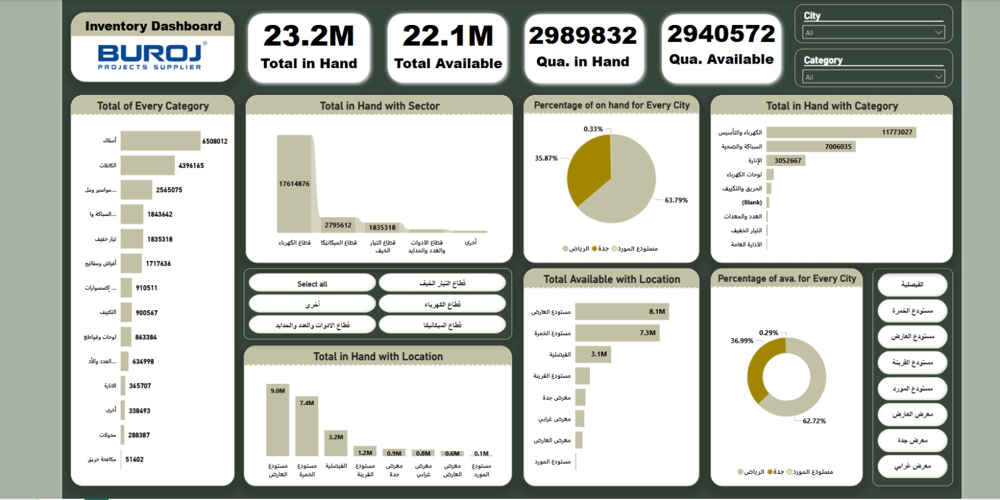

# 📦 Inventory Management Report – Power BI  

  

## 🎥 Demo Video  
[▶ Download & Watch the demo](inventory.mp4)  

## 📊 Project Overview  
This Power BI report provides a **comprehensive, real-time overview of inventory management**, helping the business track stock levels, monitor distribution, and support faster decision-making.  

## ✨ Key Features  
- Total inventory value & quantity  
- Available inventory value & quantity  
- Inventory value by warehouse  
- Breakdown by product category  
- Distribution by city (warehouse locations)  
- Analysis by business segment  

## 🎯 Goal  
The main objective of this report is to **simplify inventory visibility**, reduce manual tracking, and enable managers to make quick, informed decisions.  

---  

💡 *This repository highlights how Power BI can transform raw inventory data into actionable business insights.*  
